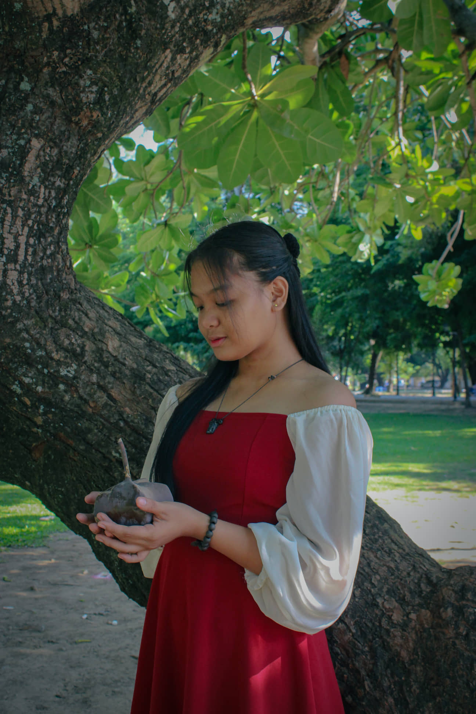
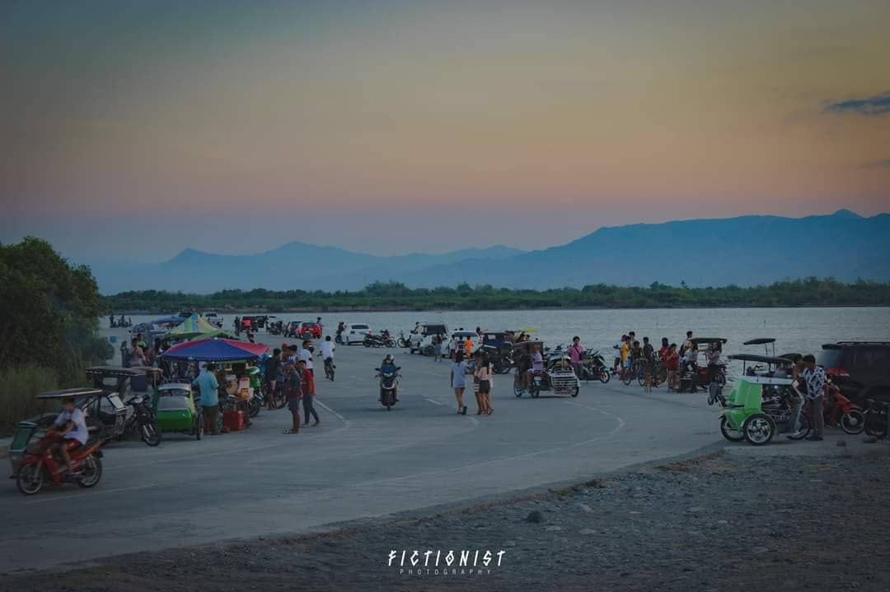
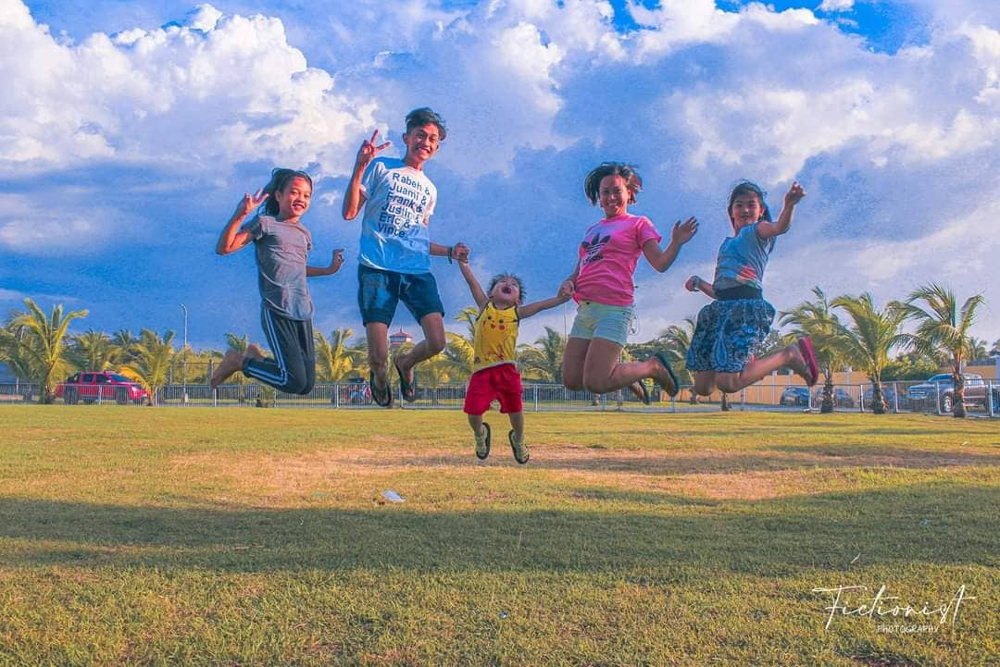

<!DOCTYPE html>
<html lang="en">
    <head>
        <meta charset="utf-8" />
        <meta name="viewport" content="width=device-width, initial-scale=1, shrink-to-fit=no" />
        <meta name="description" content="" />
        <meta name="author" content="" />
        <title> Fictionist Photography</title>
        <!-- Favicon-->
        <link rel="icon" type="image/x-icon" href="assets/favicon.ico" />
        <!-- Font Awesome icons (free version)-->
        
        <!-- Simple line icons-->
        <link href="https://cdnjs.cloudflare.com/ajax/libs/simple-line-icons/2.5.5/css/simple-line-icons.min.css" rel="stylesheet" />
        <!-- Google fonts-->
        <link href="https://fonts.googleapis.com/css?family=Source+Sans+Pro:300,400,700,300italic,400italic,700italic" rel="stylesheet" type="text/css" />
        <!-- Core theme CSS (includes Bootstrap)-->
        <link href="css/styles.css" rel="stylesheet" />
    </head>
    <body id="page-top">
        <!-- Navigation-->
        <a class="menu-toggle rounded" href="#"><i class="fas fa-bars"></i></a>
        <nav id="sidebar-wrapper">
            <ul class="sidebar-nav">
                <li class="sidebar-brand"><a href="#page-top">Menu</a></li>
                <li class="sidebar-nav-item"><a href="#page-top">Home</a></li>
                <li class="sidebar-nav-item"><a href="#about">About</a></li>
                <li class="sidebar-nav-item"><a href="#services">Services</a></li>
                <li class="sidebar-nav-item"><a href="#portfolio">Portfolio</a></li>
            </ul>
        </nav>
        <!-- Header-->
        <header class="masthead d-flex align-items-center">
            

                <h1 class="mb-1">FICTIONIST PHOTOGRAPHY</h1>
                <h3 class="mb-5"><em>Welcome to our webpage!</em></h3>
                <a class="btn btn-primary btn-xl" href="#about">See More Below</a>
            

        </header>
        <!-- About-->
        <section class="content-section bg-light" id="about">
            

                

                    

                        <h2>Fictionist Photography</h2>
                        

                            This webpage is used to avail services online and to offer what you wish for.
                        

                        <a class="btn btn-dark btn-xl" href="#services">What We Offer</a>
                    

                

            

        </section>
        <!-- Services-->
        <section class="content-section bg-primary text-white text-center" id="services">
            

                

                    <h3 class="text-secondary mb-0">Services</h3>
                    <h2 class="mb-5">What We Offer</h2>
                

                

                    

                        <i class="icon-screen-smartphone"></i>
                        <h4><strong>Mobile and DLSR Photography</strong></h4>
                        
Take every moments in your life!

                    

                    

                        <i class="icon-pencil"></i>
                        <h4><strong>Editing</strong></h4>
                        
Be amazed on everything what we can do!

                    

                    

                        <i class="icon-like"></i>
                        <h4><strong>Customization</strong></h4>
                        

                          You used to love every single customization!
                            <i class="fas fa-heart"></i>  
                        

                    

                    

                        <i class="icon-mustache"></i>
                        <h4><strong>Inquiries</strong></h4>
                        
If have to ask something you want.

                    

                

            

        </section>
        <!-- Callout-->
        
        <!-- Portfolio-->
        <section class="content-section" id="portfolio">
            

                

                    <h3 class="text-secondary mb-0">Portfolio</h3>
                    <h2 class="mb-5">Recent Projects</h2>
                

                

                    

                        <a class="portfolio-item" href="#!">
                            

                                

                                    
PRE-NUPTIAL PHOTOGRAPHY

                                    
 Imagine a photo of you and your partner, all dressed up, at a memorable place or an IG-worthy location, while doing what you two love to do together.

                                

                            

                            
                        </a>
                    

                    

                        <a class="portfolio-item" href="#!">
                            

                                

                                    
FUN SHOOT PHOTOGRAPHY

                                    
A session in which a photographer takes a number of photographs of a person or group of people.

                                

                            

                            
                        </a>
                    

                    

                        <a class="portfolio-item" href="#!">
                            

                                

                                    
LANDSCAPE PHOTOGRAPHY

                                    
A subset of photography that focuses on capturing the beauty of the natural landscapes found in the great outdoors.

                                

                            

                            
                        </a>
                    

                    

                        <a class="portfolio-item" href="#!">
                            

                                

                                    
 FAMILY PHOTOGRAPHY

                                    
All about capturing groups of people that have family ties. 

                                

                            

                            
                        </a>
                    

                

            

        </section>
        <!-- Call to Action-->

        <!-- Footer-->
        <footer class="footer text-center">
            

                <ul class="list-inline mb-5">
                    <li class="list-inline-item">
                        <a class="social-link rounded-circle text-white mr-3" href="#!"><i class="icon-social-facebook"></i></a>
                    </li>
                    <li class="list-inline-item">
                        <a class="social-link rounded-circle text-white mr-3" href="#!"><i class="icon-social-twitter"></i></a>
                    </li>
                    <li class="list-inline-item">
                        <a class="social-link rounded-circle text-white" href="#!"><i class="icon-social-github"></i></a>
                    </li>
                </ul>
                
Copyright &copy; FICTIONIST 2022

            

        </footer>
        <!-- Scroll to Top Button-->
        <a class="scroll-to-top rounded" href="#page-top"><i class="fas fa-angle-up"></i></a>
        <!-- Bootstrap core JS-->
        
        <!-- Core theme JS-->
        
    </body>
</html>
